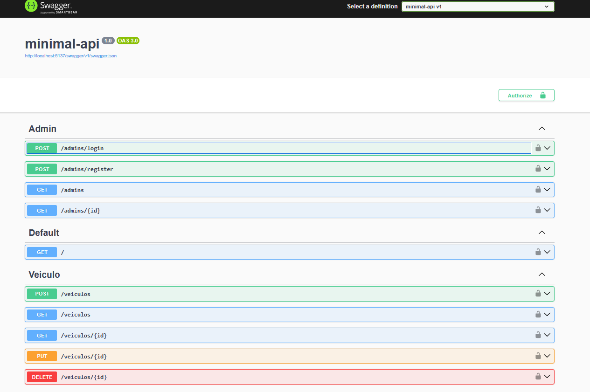

# Minimal API (.NET) – Gestão de Veículos



## Visão geral
Este projeto é uma Minimal API em .NET voltada para a gestão de administradores e veículos. Ela utiliza autenticação JWT (Bearer), documentação interativa com Swagger/OpenAPI e persistência de dados com Entity Framework Core e MySQL.

## Funcionalidades
- Autenticação e autorização com JWT
- Documentação via Swagger
- CRUD de veículos com filtros e paginação
- Endpoints de administração (login, criação e consulta)
- Integração com MySQL via EF Core (Pomelo)

## Endpoints (resumo)
- Admin
  - POST `/admins/login` – autentica e retorna JWT
  - POST `/admins/register` – cria administrador (requer papel/role)
  - GET `/admins` – lista administradores (requer papel/role)
  - GET `/admins/{id}` – detalhes de administrador (requer papel/role)
- Veículos
  - POST `/veiculos` – cria veículo (role Adm ou Editor)
  - GET `/veiculos` – lista veículos com filtros `pagina`, `nome`, `marca`, `ano`
  - GET `/veiculos/{id}` – busca por id
  - PUT `/veiculos/{id}` – atualiza
  - DELETE `/veiculos/{id}` – remove

Observação: Endpoints protegidos exigem o header `Authorization: Bearer {token}`. No Swagger, clique em "Authorize" e informe o token.

## Tecnologias
- .NET (Minimal APIs)
- Entity Framework Core + Pomelo.EntityFrameworkCore.MySql
- JWT (Microsoft.AspNetCore.Authentication.JwtBearer)
- Swagger (Swashbuckle.AspNetCore)

## Configuração
Ajuste as configurações de conexão e JWT no `appsettings.json` (local do arquivo pode ser na raiz ou dentro de `Api/`, conforme sua estrutura):

```json
{
  "ConnectionStrings": {
    "mysql": "Server=localhost;Database=minimal_api;User=root;Password=root;"
  },
  "Jwt": {
    "Key": "SUA_CHAVE_SECRETA_FORTE",
    "Issuer": "sua-issuer",
    "Audience": "sua-audience"
  }
}
```

- `Jwt:Key`: chave secreta usada para assinar tokens (use valor forte/seguro)
- `Jwt:Issuer` e `Jwt:Audience`: identidades usadas na validação do token

## Como executar
Você pode rodar a API a partir da pasta do projeto (por exemplo, `Api/`):

1) Restaurar e compilar
- `dotnet restore`
- `dotnet build`

2) Executar
- `dotnet run`
- (opcional) `dotnet watch run` para hot reload

3) Acessar o Swagger
- URL típica: `http://localhost:5137/swagger` (a porta pode variar)

## Fluxo de autenticação (JWT)
1. Envie `POST /admins/login` com as credenciais válidas
2. Copie o token retornado na resposta
3. No Swagger, clique em "Authorize" e informe: `Bearer SEU_TOKEN`
4. Acesse os endpoints protegidos

## Estrutura (exemplo simplificado)
```
minimal-api/
├── Api/
│   ├── Program.cs
│   └── assets/
│       └── image.png
├── Test/
│   └── MSTestSettings.cs
└── README.md
```

## Migrações (EF Core)
- Criar migração: `dotnet ef migrations add NomeDaMigracao`
- Atualizar banco: `dotnet ef database update`

(Instale a ferramenta se necessário: `dotnet tool install --global dotnet-ef`)

